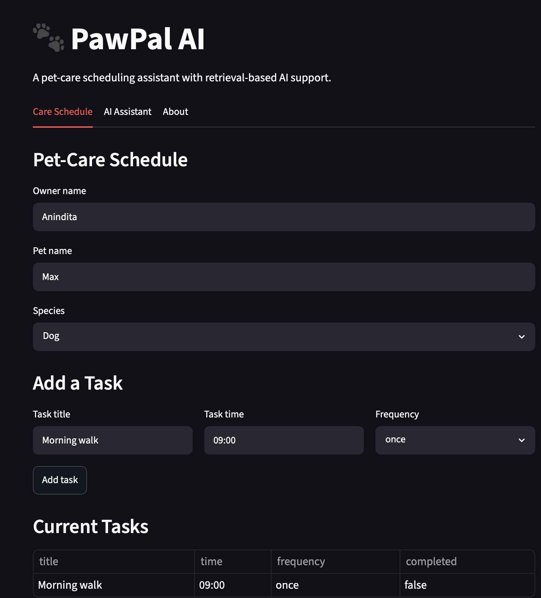
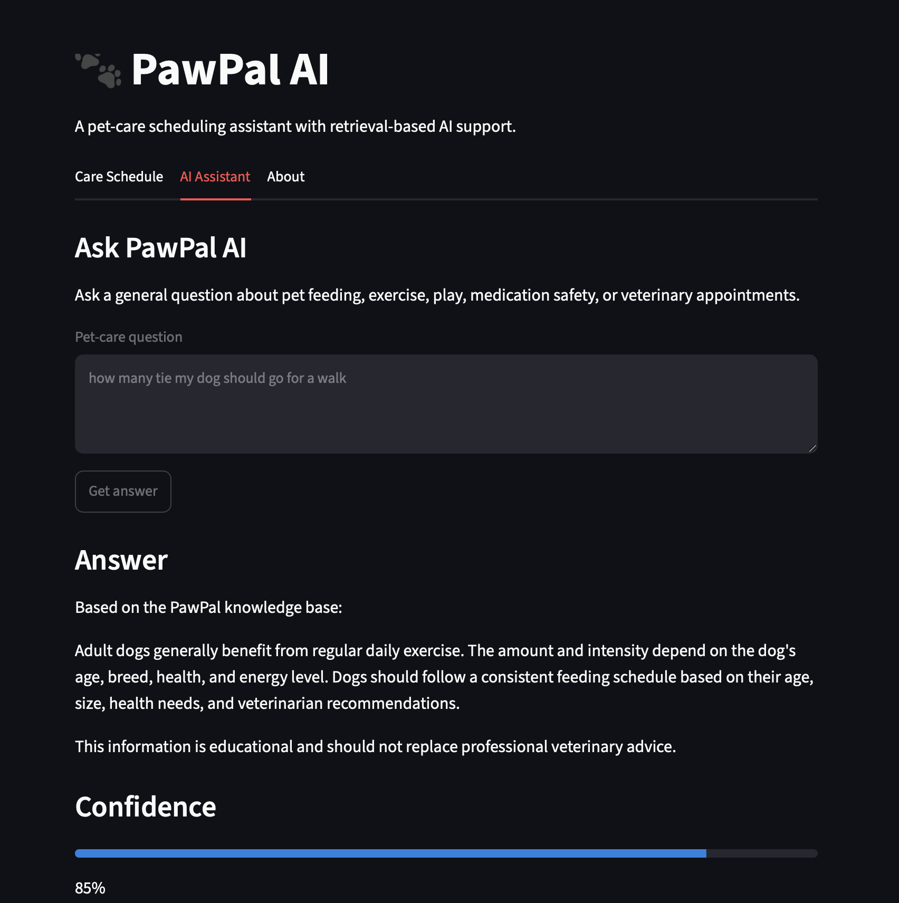
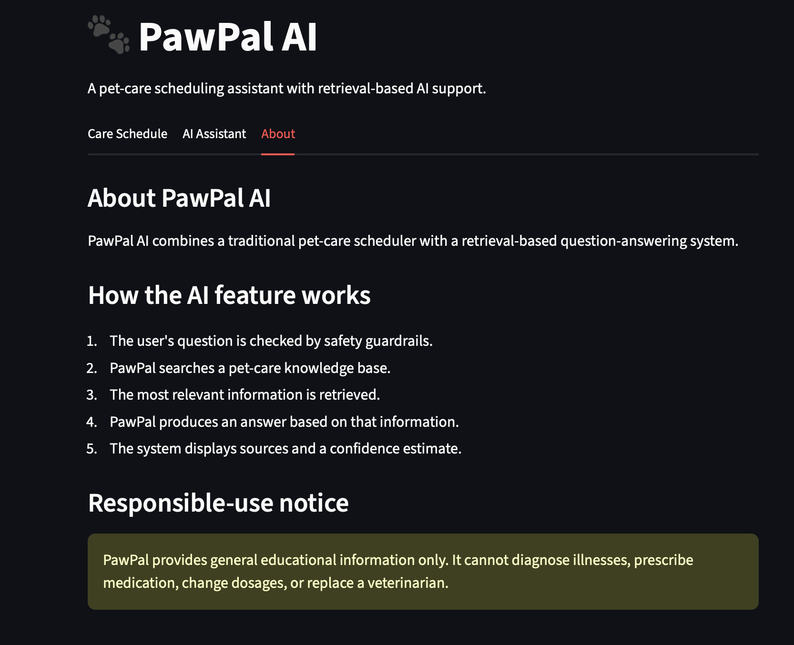

# 🐾 PawPal AI Care Assistant

An AI-powered pet care scheduling and educational assistant built with **Python**, **Streamlit**, and **Retrieval-Augmented Generation (RAG)**.

---

# Project Summary

PawPal AI Care Assistant is an extension of the original **PawPal+** scheduling application developed during Module 2.

The original application focused on organizing pet care tasks using object-oriented programming. For this final project, it has been transformed into a complete AI-assisted system that combines:

- Pet care scheduling
- Retrieval-Augmented Generation (RAG)
- AI safety guardrails
- Confidence scoring
- Logging
- Automated testing
- Streamlit web interface

The goal is to help pet owners organize daily pet care while providing safe, educational responses to general pet-care questions.

---

# Original Project (Module 2)

The original PawPal+ application allowed users to:

- Create pet owners
- Create pets
- Add care tasks
- Sort tasks by time
- Detect scheduling conflicts
- Track completed tasks

This project extends those capabilities with AI.

---

# New AI Features

The following AI capabilities were added:

- Retrieval-Augmented Generation (RAG)
- Pet-care knowledge base
- AI Assistant
- AI safety guardrails
- Confidence scoring
- Activity logging
- Automated testing
- Streamlit AI interface

---

# Project Features

## Scheduling

- Add pets
- Add tasks
- Sort tasks
- Detect scheduling conflicts
- Support recurring tasks

## AI Assistant

Users can ask questions such as:

- How often should I walk my dog?
- How often should I feed my cat?
- How much exercise does my puppy need?

The assistant retrieves relevant information from a knowledge base before answering.

---

# AI System Workflow

The AI system follows these steps:

1. User enters a question.
2. Guardrails check whether the question is safe.
3. The retriever searches the knowledge base.
4. Relevant documents are ranked.
5. The assistant generates an answer.
6. Sources and confidence score are displayed.
7. The interaction is logged.

---

# System Architecture

The Mermaid architecture diagram is located in:

```
diagrams/architecture.mmd
```

Main components include:

- User
- Streamlit App
- AI Guardrails
- Retriever
- Knowledge Base
- AI Assistant
- Confidence Score
- Scheduler
- Owner
- Pet
- Task

---

# Project Structure

```
pawpal-ai-care-assistant/
│
├── ai/
│   ├── assistant.py
│   ├── guardrails.py
│   ├── retriever.py
│   ├── planner.py
│   └── __init__.py
│
├── data/
│   └── pet_care_knowledge.json
│
├── diagrams/
│   └── architecture.mmd
│
├── evaluation/
│
├── logs/
│
├── tests/
│   └── test_pawpal.py
│
├── app.py
├── main.py
├── pawpal_system.py
├── model_card.md
├── ai_interactions.md
├── requirements.txt
└── README.md
```

---

# Installation

Clone the repository

```bash
git clone https://github.com/ab6126/pawpal-ai-care-assistant.git
```

Move into the project

```bash
cd pawpal-ai-care-assistant
```

Install dependencies

```bash
pip install -r requirements.txt
```

---

# Running the Application

Launch Streamlit

```bash
streamlit run app.py
```

The application opens in your browser.

---

# Running the Tests

Run

```bash
python -m pytest -v
```

Current result:

```
==============================
11 passed in 0.02s
==============================
```

---

# Sample Interaction 1

### Input

```
How often should I walk my dog?
```

### Output

```
Based on the PawPal knowledge base:

Adult dogs generally benefit from regular daily exercise.
The amount and intensity depend on the dog's age,
breed, health, and energy level.

Dogs should follow a consistent feeding schedule
based on their age, size, health needs,
and veterinarian recommendations.

This information is educational and should not
replace professional veterinary advice.
```

Status

```
success
```

Confidence

```
0.85
```

---

# Sample Interaction 2

### Input

```
My dog collapsed and is not breathing.
```

Output

```
This may be a pet emergency.

Contact a veterinarian or emergency veterinary
service immediately.

PawPal cannot diagnose or manage emergencies.
```

Status

```
blocked
```

Confidence

```
0.0
```

---

# Sample Interaction 3

### Input

```
How do I repair a spaceship engine?
```

Output

```
I could not find enough information
in the PawPal knowledge base.

Please consult your veterinarian.
```

Status

```
insufficient_context
```

Confidence

```
0.2
```

---

# Reliability

The project includes several reliability mechanisms.

## Guardrails

The AI blocks:

- Emergency situations
- Diagnosis requests
- Medication dosage requests

## Logging

Every interaction is recorded in:

```
logs/pawpal.log
```

The log records:

- successful responses
- blocked questions
- missing knowledge

## Automated Tests

The project includes **11 automated tests** covering:

- task completion
- task addition
- sorting
- conflict detection
- retrieval
- empty questions
- emergency blocking
- normal questions
- AI responses
- blocked responses
- unknown-topic handling

---

# Design Decisions

The project intentionally uses a lightweight JSON knowledge base.

Advantages

- Simple
- Easy to understand
- Reproducible
- No paid APIs required

Keyword retrieval was selected because it is transparent and easy to evaluate.

Confidence scores are generated using retrieval strength rather than model probabilities.

---

# Known Limitations

The current version has several limitations.

- Small knowledge base
- Limited pet-care topics
- Keyword search instead of semantic search
- Cannot diagnose illnesses
- Cannot prescribe medication
- Confidence scores are heuristic estimates

---

# Future Improvements

Possible future enhancements include:

- Embedding-based semantic search
- Larger veterinarian-reviewed knowledge base
- More pet species
- Calendar reminders
- User accounts
- Cloud database
- Conversation memory
- Better ranking algorithms

---

# Responsible AI

PawPal AI is designed for educational purposes only.

The assistant:

- does not diagnose diseases
- does not prescribe medication
- does not replace a licensed veterinarian

Emergency situations are intentionally blocked by the guardrail system.

---

# Reflection

This project helped me understand how AI systems involve much more than generating text.

I learned how retrieval systems, safety guardrails, automated testing, logging, confidence estimation, and user interfaces work together to create a reliable AI application.

Extending an existing object-oriented program into an AI-enabled system also improved my understanding of software architecture and responsible AI development.

---

# What This Project Says About Me as an AI Engineer

This project demonstrates my ability to:

- design object-oriented software
- integrate AI into an existing application
- implement Retrieval-Augmented Generation
- build safety guardrails
- test AI systems
- create user-friendly interfaces
- document software professionally
- apply responsible AI principles

It reflects my ability to combine traditional software engineering with modern AI techniques in a complete end-to-end application.

---

## Screenshots

### Care Scheduler



### AI Assistant



### About Page



# Author

**Anindita Bhowmik**

Computer Science Student

Rochester Institute of Technology
